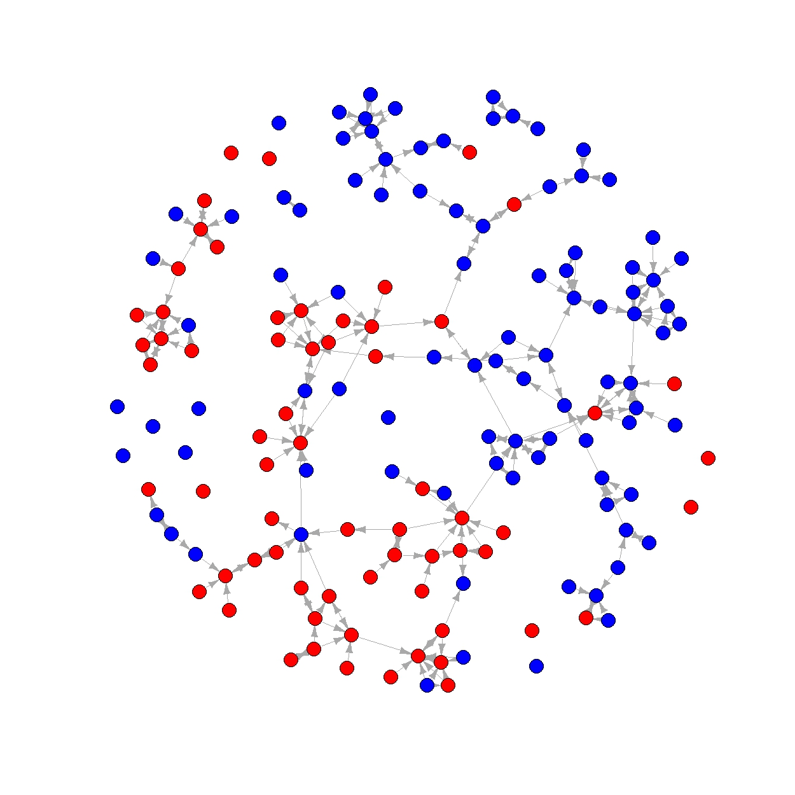
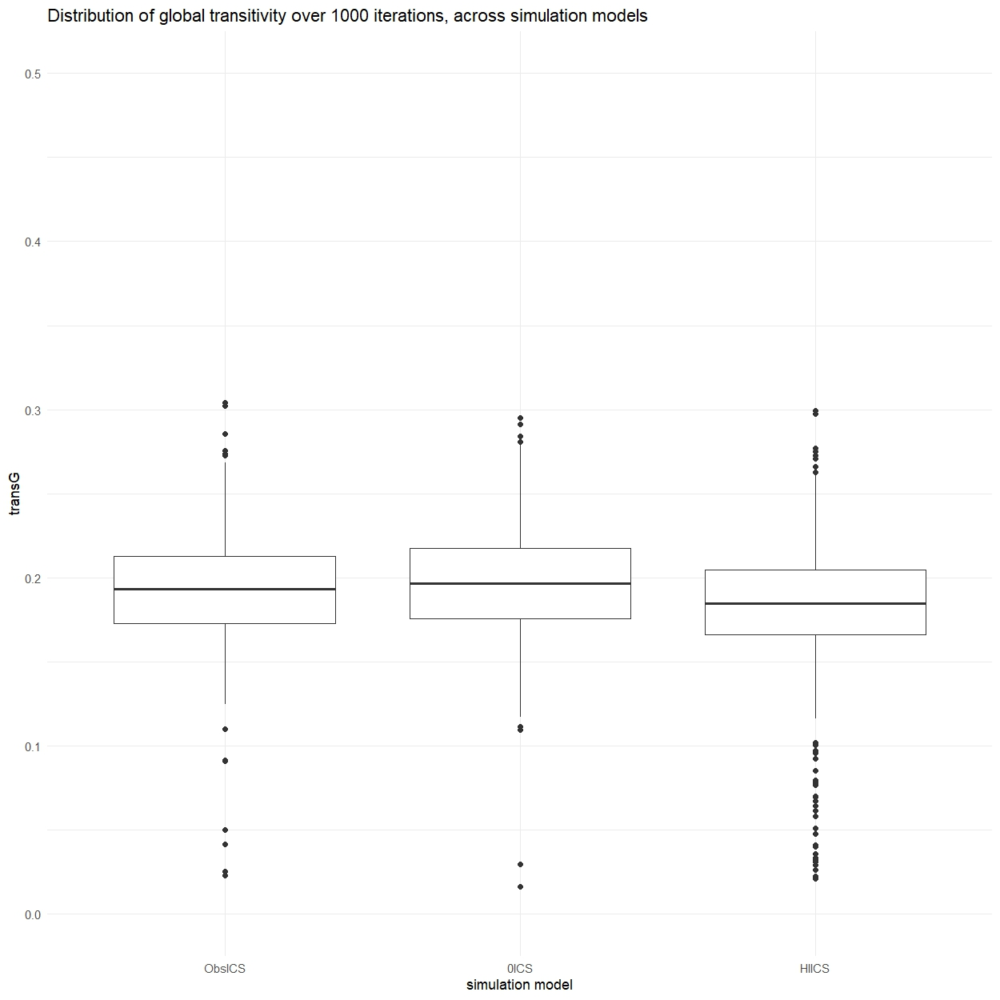

```{=html}
<style>
body {
  text-align: justify;
  font-family: Times;
}

h1, .h1, h2, .h2, h3, .h3 {
  margin-top: 24px;
  font-family: Times;
}
</style>
```
```{r setup, include=FALSE}
knitr::opts_chunk$set(echo = TRUE)
```

# Analyses

Three main steps will be taken to ascertain whether sociologists tend to collaborate with colleagues affiliated with the same graduate school. First, the network will be descriptively analysed using several network statistics and visualisations. This should give a first indication of the prevalence of collaborations between sociologists from different graduate schools, the amount of triads and transitive triads and the structure and composition of the network. 	
 	Secondly, successive Stochastic Actor Oriented Models (SAOM) are estimated using RSiena to test whether the creation and maintenance of collaboration ties between the first and second timepoint is influenced by a preference for collaboration with alters with the same graduate school affiliation. The first of these models includes only the default effects of density and reciprocity, the second model adds the ICS affiliation variable, the third adds the control variables. The fourth model build upon the third by adding structural effects until a satisfactory goodness of fit is achieved. The fifth model serves as a robustness check, it includes the two separate ICS affiliation variables and serves to check the assumption that both variables have a similar effect, as this is assumed in the theory.	
 	Thirdly, simulations are used to test hypothesis two, that the preference to work with alters affiliated with the same graduate school significantly contributes to clustering in the network. The simulations fix the effects of all variables at their observed estimates from model four and uses these parameters to simulate how to observed network at wave one would change given the effects of the variables. By comparing the two transitivity scores of a simulation with the observed effect of ICS affiliation two others, one where the effect of ICS affiliation is set to zero and one where it is doubled, the simulations will be used to check whether significantly more clustering occurs if the effect of ICS affiliation is doubled and significantly less when it is absent. This way, the hypothesis regarding the network level effect of the individual preference to collaborate within ones graduate school is explicitly tested.


## Network visualisations

In order to get a first impression of our collaboration network, it is visualised in the form of three graphs. In each graph, sociologists affiliated with ICS are shown as red nodes, those not affiliated with ICS are coloured blue. No further variables are included in the visualisations. The first graph is a visualisation of wave 1, which shows a considerable amount of isolates. Out of the 458 nodes, 158 had a tie in wave 1, leaving 300 isolates. There are fewer isolates in wave 2, with 213 nodes having a tie, this there were 245 isolates in this wave. The amount of isolates makes it more difficult to see any possible clusters in the network, which is why both waves are also visualised without the isolates. 	
 	The second graph shows wave 1 without isolates, here it can be seen that there are groups of collaborating sociologists, some of these groups are homogenous when it comes to whether their members are associated with ICS, while other groups are mixed. If there is no preference for same graduate school cooperation at all, the expectation would be that approximately one third of the sociologists in each group would be affiliated with ICS, since that is their proportion of the sociologists in the data. However, most groups in the graph seem to be made up of a majority of either sociologists which are or are not affiliated, with only one or two from the other group. This grants the impression that the expected clustering may be present, but it does not exclude that it is caused by sociologists collaborating with colleagues at their own university, which are fairly homogenous in whether they are ICS affiliated or not. 
 	The third graph shows the collaboration network in wave 2, which displays a similar pattern. Also noteworthy is that there are several fully homogenous groups of sociologists who are not affiliated with ICS, but groups with majority ICS affiliated sociologists frequently seem to include multiple non affiliates. Overall, the visualisations of both waves show patterns which do not clearly prove or disprove the hypotheses. Further analysis is required to confirm or deny the hypotheses.

Code used for making the graphs
```{r,eval=F}
#Visualising the network

#Only wave 1 with isolates
netvis0 <- igraph::graph_from_adjacency_matrix(
  sndata1$nets[1,,],
  mode = c("directed"),
  weighted = NULL,
  diag = FALSE,
  add.colnames = NULL,)

plot(netvis0,
  vertex.color = ifelse(df_egoF$icsAny == 1, "red", "blue"),
  vertex.label = NA,
  vertex.size = 5,
  edge.width = 0.2,
  edge.arrow.size =0.2)

#Without isolates
#Wave 1
noisolates1 = rowSums(sndata1$nets[1,,]) > 0
netNiso1 = sndata1$nets[1,noisolates1,noisolates1]
dfNiso1 = df_egoF[noisolates1, ]

netvis1 <- igraph::graph_from_adjacency_matrix(
  netNiso1,
  mode = c("directed"),
  weighted = NULL,
  diag = FALSE,
  add.colnames = NULL,)

plot(netvis1,
  vertex.color = ifelse(dfNiso1$icsAny == 1, "red", "blue"),
  vertex.label = NA,
  vertex.size = 5,
  edge.width = 0.2,
  edge.arrow.size =0.2)

#Wave 2
noisolates2 = rowSums(sndata1$nets[2,,]) > 0
netNiso2 = sndata1$nets[2,noisolates2,noisolates2]
dfNiso2 = df_egoF[noisolates2, ]

netvis2 <- igraph::graph_from_adjacency_matrix(
  netNiso2,
  mode = c("directed"),
  weighted = NULL,
  diag = FALSE,
  add.colnames = NULL,)

plot(netvis2,
  vertex.color = ifelse(dfNiso2$icsAny == 1, "red", "blue"),
  vertex.label = NA,
  vertex.size = 5,
  edge.width = 0.2,
  edge.arrow.size =0.2)

#Amount of non isolates per wave
dim(netNiso1)
dim(netNiso2)

```

### Graph 1. wave 1 with isolates


### Graph 2. wave 1 without isolates



### Graph 3. wave 2 without isolates


## Descriptive statistics

To gain further insight into the structure of the collaboration networks, descriptive statistics are reported. The first of these statistics is the Jaccard Similarity Index, which shows the similarity between the networks at the two waves. The Jaccard index ranges from 0 to 1, with 0 indicating no similarity and 1 complete similarity. In the event that similarity is too high, the RSiena models will have no tie changes to explain. The Jaccard index for the difference between wave 1 and 2 is 0.177, this indicates that the network at wave 2 is substantially different from the network at wave 1 without being completely different, which is promising for the RSiena models. The density of the network at both waves seems to be quite low, with 0.001 for wave 1 and 0.002 for wave 2. This is consistent with the considerable proportion of isolates reported before in the network visualisation section. The low density is likely caused by a combination of the many isolates and the nodes that do have ties often only have one or two, which is also visible in the graphs. The global and average transitivity scores for wave 1 are 0.248 and 0.435 respectively. For wave 2 these are 0.203 and 0.378. This indicates a decrease in the proportion of transitive triads in wave 2 compared to wave 1. Also, higher degree nodes seem to have less of a tendency toward transitivity than low degree nodes, since the global transitivity score gives greater weight to high degree nodes and is lower than the average transitivity in both waves. Overall this gives the impression that high degree nodes may be engaged in more collaborations with fewer nodes per collaboration,  whereas the lower degree nodes have fewer collaborations, but with more nodes in each collaboration.

Descriptives calculation
```{r,eval=F}

#Density and Jaccard
fjac(wave1,wave2)
fdens(458,wave1)
fdens(458,wave2)

#Calculating the transitivities
transitivity(netvis1)
transitivity(netvis1,type='average')
transitivity(netvis2)
transitivity(netvis2,type='average')


```


## RSiena models

As described in the methods section, the main test of hypothesis 1 consists of several stochastic actor oriented models carried out using the RSiena package. The successive models are intended to be compared to one another to check if the added variables of each subsequent model improve the convergence and goodness of fit. The models are now presented in order. The overall maximum convergence ratios and goodness of fit as measured by Mahalanobis distance for the indegree distribution, outdegree distribution and triad census for each model is shown in table 3. The top row of table 3 (‘Target’) shows the desired minimum value for each statistic, these are not hard requirements, but reaching these values is strongly preferable since they indicate that the model corresponds well to the observed data [@Rsiena]. 	
 	For each model, tables 1 and 2 display the parameter estimates (theta), standard errors (SE) and t-values for the covariate and structural effects, respectively. The parameter estimates indicate the weight given to a variable in the evaluation function of actors in the network, as explained in the methods section. These parameter estimates are the main outcomes of interest, since they give an indication of whether the variables were of importance in the changes in ties that occurred between waves 1 and 2. The estimates of one effect are not comparable to the estimates of another because they are dependent on the scale of the variables as well as correlations between variables, so the estimates only serve to give a rough indication of whether an effect mattered. The standard errors are also included because they are used to determine the statistical significance of the effects, a t-value can be calculated to by dividing the parameter estimate by its standard error, this t-value then serves as an indicator for significance [@Rsiena]. The decision rule for the analysis is that an effect must be significant at the α = 0.05 level, which corresponds to an absolute t-value of 2 or greater [@Rsiena]. 

### Modelling results summary
```{r}
#Tables with summarised model results

#Defining function again because it doesnt work otherwise
require(tidyr)
#fshowdf: To print objects (tibbles / data.frame) nicely on screen in .rmd
fshowdf <- function(x, ...) {
    knitr::kable(x, digits = 2, "html", ...) %>%
        kableExtra::kable_styling(bootstrap_options = c("striped", "hover")) %>%
        kableExtra::scroll_box(width = "100%", height = "300px")
}

#Table of convergence and fit statistics
model <- c("Target", "Model 1", "Model 2", "Model 3", "Model 4", "Model 5", "Model 6")
conv <- c('<0.25', 0.048, 0.377, 0.199, 0.323, 0.209, 1.119)
indegreegof <- c('>0.05', 0, 0.007, 0.006, 0.024, 0.010, 0.037)
outdegreegof <- c('>0.05', 0.003, 0.007, 0.003, 0.069, 0.062, 0.075)
triadgof <- c('>0.05', 0, 0.004, 0.003, 0.093, 0.014, 0.093)
convGOFdf <- data.frame(Model=model,Max.Conv=conv,
                        IndegreeGOF=indegreegof,OutdegreeGOF=outdegreegof,
                        TriadGOF=triadgof)

#Combined table of results for structural variables
model2<-c("Model 1", "Model 2", "Model 3", "Model 4", "Model 5", "Model 6")
densityEst<-c(-3.82, -3.97, -4.62, -3.26, -3.11, -2.61)
densitySe<-c(0.08, 0.18, 0.29, 0.82, 1.44, 0.77)
densityT<-c(-46.54, -21.69, -15.41, -3.96, -2.16, -3.39)
recipEst<-c(3.25, 2.06, 1.88, 2.58, 2.55, 2.69)
recipSe<-c(0.19, 0.21, 0.21, 0.36, 0.31, 0.50)
recipT<-c(17.21, 10.07, 9.11, 7.17, 8.24, 5.39)
transtrEst<-c(' ', 1.11, 0.98, 1.51, 1.55, 1.71)
transtrSe<-c(' ', 0.14, 0.14, 0.27, 0.39, 0.43)
transtrT<-c(' ', 8.05, 7.12, 5.68, 3.99, 3.96)
inpopEst<-c(' ', 0.17, 0.17, 0.19, 0.18, 0.19)
inpopSe<-c(' ', 0.04, 0.06, 0.04, 0.11, 0.04)
inpopT<-c(' ', 4.43, 2.79, 4.64, 1.58, 4.55)
outactEst<-c(' ', ' ', ' ', -0.20, -0.22, -0.29)
outactSe<-c(' ', ' ', ' ', 0.11, 0.18, 0.13)
outactT<-c(' ', ' ', ' ', -1.90, -1.19, -2.35)
inactEst<-c(' ', ' ', ' ', -0.56, -0.59, -0.71)
inactSe<-c(' ', ' ', ' ', 0.26, 0.30, 0.45)
inactT<-c(' ', ' ', ' ', -2.17, -1.98, -1.59)
isoEst<-c(' ', 4.24, 4.09, 5.49, 5.74, 5.82)
isoSe<-c(' ', 0.78, 0.68, 1.11, 2.45, 0.85)
isoT<-c(' ', 5.43, 5.99, 4.97, 2.34, 6.85)
strucResultdf<-data.frame(Model=model2, DensityEst=densityEst,DensitySE=densitySe,DensityT=densityT,
                          RecipEst=recipEst,RecipSE=recipSe,RecipT=recipT,
                          TransEst=transtrEst,TransSE=transtrSe,TransT=transtrT,
                          InpopEst=inpopEst,InpopSE=inpopSe,InpopT=inpopT,
                          OutactEst=outactEst,OutactSE=outactSe,OutactT=outactT,
                          InactEst=inactEst,InactSE=inactSe,InactT=inactT,
                          IsolEst=isoEst,IsolSE=isoSe,IsolT=isoT)

#Covariate estimates, standard errors and t statistics
model3<-c('Model 2', 'Model 3', 'Model 4', 'Model 5', 'Model 6')
anyICSest<-c(0.41, 0.21, 0.19, 0.19, ' ')
anyICSse<-c(0.10, 0.12, 0.13, 0.11, ' ')
anyICSt<-c(4.12, 1.79, 1.49, 1.70, ' ')
affICSest<-c(' ', ' ', ' ', ' ', -0.05)
affICSse<-c(' ', ' ', ' ', ' ', 0.14)
affICSt<-c(' ', ' ', ' ', ' ', -0.36)
gradICSest<-c(' ', ' ', ' ', ' ', -0.13)
gradICSse<-c(' ', ' ', ' ', ' ', 0.19)
gradICSt<-c(' ', ' ', ' ', ' ', -0.68)
uniest<-c(' ', 1.18, 1.21, 1.21, 1.28)
unise<-c(' ', 0.11, 0.13, 0.11, 0.11)
uniT<-c(' ', 10.35, 9.16, 11.29, 11.29)
funcest<-c(' ', 0.43, 0.41, 0.42, 0.39)
funcse<-c(' ', 0.23, 0.26, 0.23, 0.33)
funcT<-c(' ', 1.89, 1.61, 1.81, 1.19)
genest<-c(' ', 0.05, 0.06, 0.06, 0.07)
gense<-c(' ', 0.09, 0.12, 0.11, 0.12)
genT<-c(' ', 0.49, 0.53, 0.54, 0.59)
covarResultdf<-data.frame(Model=model3,ICSest=anyICSest,ICSse=anyICSse,ICSt=anyICSt,
                          UnivEst=uniest,UnivSE=unise,UnivT=uniT,
                          FunctEst=funcest,FunctSE=funcse,FunctT=funcT,
                          GendEst=genest,GendSE=gense,GendT=genT,
                          AffilICSest=affICSest,AffilICSse=affICSse,AffilICSt=affICSt,
                          GradICSest=gradICSest,GradICSse=gradICSse,GradICSt=gradICSt)

fshowdf(covarResultdf)
fshowdf(strucResultdf)
fshowdf(convGOFdf)

```


### Null model

The first model only includes density and reciprocity effects and serves only as a null model. The density and reciprocity effects are included by default in RSiena models. As can be seen in table 3, the overall maximum convergence ratio of model 1 is 0.048, which is below the maximum target value of 0.25, so the model converges quite well. However, the goodness of fit statistic for neither of the three assessed network statistics meets the target value of 0.05 or greater. These results indicate that the null model is insufficient for explaining the observed tie changes between waves 1 and 2, which is not surprising, but is still useful as a benchmark for the following models.

Model 1 code
```{r,eval=F}
#Create main algorithm
algoMain<-sienaAlgorithmCreate()

#Now to specify the models
#Model 1: the null model with only density and reciprocity
effects1<-getEffects(collabnet1)

#Estimate model 1
testEstimate1<-siena07(algoMain,data=collabnet1,effects=effects1,returnDeps=TRUE)
testEstimate1

#Goodness of fit testing for model 1
model1gof1 <- sienaGOF(testEstimate1, IndegreeDistribution, verbose = FALSE, join = TRUE, varName = "net")
model1gof2 <- sienaGOF(testEstimate1, OutdegreeDistribution, verbose = FALSE, join = TRUE, varName = "net")
model1gof3 <- sienaGOF(testEstimate1, TriadCensus, verbose = FALSE, join = TRUE, varName = "net")
plot(model1gof1)
plot(model1gof2)
plot(model1gof3)

#t-value calculation to check significance of effects in model 1
result1df<-cbind.data.frame(testEstimate1$theta,testEstimate1$se)
names(result1df)<-c('theta','se')
result1df$ttest<-result1df$theta/result1df$se

```

### First test without controls

The second model adds the effect of tendency to collaborate with alter with the same ICS affiliation (‘ICS affiliation’), which is the main covariate of interest for testing hypothesis 1. The model also adds the transitive triplets and indegree popularity structural effects which are recommended in the manual for RSiena [@Rsiena]. This model serves as a first indicator of whether hypothesis 1 may have merit, but does not yet include the control variables which would allow for a more conclusive test. Though it is not yet conclusive, table 1 shows that the ICS affiliation variable (referred to as ‘ICSest’ in table 1) does have an effect. It can be tentatively concluded from this that sociologists are more likely to create and maintain collaborative ties to colleagues if both or neither of them are affiliates or graduates of ICS, compared to when one of them is affiliated and the other is not. This is further substantiated by the t-value (t = 4.12), which indicates that the statistical significance of the effect is well below the chosen threshold for significance (p < 0.05). Model 2 shows worse overall maximum convergence, but improvement in goodness of fit compared to model 1. The overall maximum convergence exceeds the target maximum value of 0.25, indicating that the models convergence is worse than that of model 1 and overall unsatisfactory. The target values for the three network statistics are not met either, but model 2 does get closer than model 1 did. The addition of the transitive triplets and indegree popularity effects likely contributed to this improvement.

Model 2 code
```{r,eval=F}
#Model 2: adds the main ego level covariate 'icsany' and the structural effects
effects2<-getEffects(collabnet1)
#Included effects
  effects2<-includeEffects(effects2,isolateNet,inPop,transTrip)
  effects2<-includeEffects(effects2,sameX,name='net',interaction1='icsanyD')

#Estimate model 2
testEstimate2<-siena07(algoMain,data=collabnet1,effects=effects2,returnDeps=TRUE)
testEstimate2
  
#Goodness of fit testing for model 2
model2gof1 <- sienaGOF(testEstimate2, IndegreeDistribution, verbose = FALSE, join = TRUE, varName = "net")
model2gof2 <- sienaGOF(testEstimate2, OutdegreeDistribution, verbose = FALSE, join = TRUE, varName = "net")
model2gof3 <- sienaGOF(testEstimate2, TriadCensus, verbose = FALSE, join = TRUE, varName = "net")
plot(model2gof1)
plot(model2gof2)
plot(model2gof3)

#t-value calculation to check significance of effects in model 2
result2df<-cbind.data.frame(testEstimate2$theta,testEstimate2$se)
names(result2df)<-c('theta','se')
result2df$ttest<-result2df$theta/result2df$se

```

### Main models testing hypothesis one

The third, fourth and fifth model will be treated jointly, since they have the same implication with regard to hypothesis 1. Model 3 adds the effects of the three control variables; tendency to collaborate with alters at ego’s own university (‘university affiliation’), tendency to avoid collaboration with alters with the same function as ego (‘function’) and tendency to collaborate with alters with the same gender as ego (‘gender’). The intent is to check whether the sameX effect of ICS affiliation remains significant if the controls are included in the model. As can be seen in table 1, this is arguably not the case. In models 3, 4 and 5, t-values of the ICS affiliation effects are above the chosen limit for significance (t >= 2, p < 0.05), meaning that under the decision rule set before the analysis was carried out, we must conclude that there is no significant effect and hypothesis 1 is tentatively rejected. Tentatively, because it should be mentioned that the effects of ICS affiliation are still significant at the α = 0.10 level. This is certainly not cause to consider the hypothesis confirmed either, but the absence of a tendency to collaborate with others affiliated with the same graduate school cannot be stated with absolute certainty. This will be elaborated upon in the conclusion. 	
 	With regard to the effects of the control variables, the gender and function effects are both insignificant in all three models, as seen in table 1. Especially the gender effect is far from significant, which shows that there seems to be no tendency to collaborate with alters who share the same gender as ego. The t-value of the function effect is below the minimum value that would be considered significant, but as with ICS affiliation, it is significant at the α = 0.1 level. As such, whether or not sociologists have a tendency not to collaborate with colleagues with the same function as themselves is not quite certain, which is further covered in the conclusion. Consistently with prior literature [@Ashwin], the effect of university affiliation is unambiguously important, based on the high t-values. This indicates that working at the same university makes it much more likely for two sociologists to collaborate. This strong tendency to collaborate within universities combined with the fact that graduate schools are linked to the sociology departments of specific universities likely explains why a significant effect of ICS affiliation was found in model 2, sociologists do collaborate more with others affiliated with the same graduate school, but in large part because they are much more likely to work at the same departments. 	
 	While the conclusions drawn about the covariate effects are the same across models 3, 4 and 5, the convergence and fit differ between the models. Model 3 is the original intended test of hypothesis 1, models 4 and 5 are intended to improve the convergence and fit of model 3. Model 4 is included because model 3 suffers from poor fit, the Mahalanobis distance of the indegree distribution, outdegree distribution and triad census is far below the preferred minimum of 0.05 suggested [@Rsiena]. This means that these three network characteristics of the model do not correspond closely to those of the observed network at wave 2, which puts into question whether the parameter estimates are accurate representations of the actual behaviour of the sociologists. Multiple iterations of model 4 were estimated to test if the goodness of fit improved, the two structural effects that did improve fit and were thus retained are indegree activity and oudegree activity. Other effects that were tested but worsened the fit were: outdegree popularity, the squared version of indegree popularity and the exclusion of the gender or function control variables. As can be seen in table 3, adding in- and outdegree activity effects did substantially improve fit compared to model 3, with model 4 having sufficient goodness of fit with regard to the outdegree distribution and triad census. However, no statistic was found which lead to an acceptable goodness of fit for the indegree distribution, each estimated model consistently overestimated the amount indegrees the nodes would have. Since no statistic was found which fixed this issue, sufficient fit for two out of three network statistics was accepted as being close enough to the desired fit. 	
 	Table 3 also shows that while model 4 may have a substantially better fit than model 3, it also has a worse overall maximum convergence ratio. The overall maximum convergence of model 4 is 0.323, which exceeds the maximum acceptable value of 0.25. Model 5 is estimated to improve upon this characteristic of model 4. Model 5 contains the same structural and covariate effects as model 4, but their starting values are set to the estimated parameter values from model 4. According to the RSiena manual, this should improve the overall maximum convergence ratio by starting the estimation at a point closer to the eventual estimated values [@Rsiena]. As expected, model 5 has considerably better overall maximum convergence than model 4, with minimal differences in the parameter estimates. The overall maximum convergence ratio of model 5 is 0.209, which is below the accepted maximum. Even though the convergence of model 5 is an improvement over model 4, the model fit is considerably worse. Model 5’s goodness of fit for the triad census is much lower than model 4’s, so model 5 only has sufficient fit when looking at the outdegree distribution. In general, neither model 4 nor 5 is unambiguously better than the other, but the fact that there is one model with good convergence and one with decent goodness of fit and that the parameter estimates of the covariate effects hardly differ between these models does lend additional confidence that the reported effects are more than artifacts of poorly specified models.	
	The results of model 6 serve to moderate this confidence somewhat. Model 6 is a robustness check which includes the sameX effects of being an ICS affiliated staff member and being an ICS graduate separately, instead of using the combined variable. Table 1 shows the parameter estimates and t-values of the two ICS variables. The sameX effects of the two ICS variables are insignificant, based on the t-values being -0.36 and -0.68. So even though the combined ICS variable used in the other models was still significant at α=0.10, the separate variables are not significant at all, indicating that the tendency to collaborate with alters with the same ICS affiliation as ego is not present unless the two ICS variables are estimated as a combined effect. Other notable features of model 6 are the very poor overall maximum convergence ratio of 1.119 and the decent goodness of fit for the outdegree distribution and triad census. The goodness of fit of model 6 is considerably better than model 5, but fairly similar to model 4, while model 4 does have a better convergence ratio. Overall, model 6 is not better in convergence and fit than earlier models, which gives the impression that the combined ICS variable in models 4 and 5 does not cause poor fit. 

Model 3 code
```{r,eval=F}
#Model 3: adds the ego level control variables
effects3<-getEffects(collabnet1)
#Included effects
  effects3<-includeEffects(effects3,isolateNet,inPop,transTrip)
  effects3<-includeEffects(effects3,sameX,name='net',interaction1='genderD')
  effects3<-includeEffects(effects3,sameX,name='net',interaction1='universityN')
  effects3<-includeEffects(effects3,sameX,name='net',interaction1='icsanyD')
  effects3<-includeEffects(effects3,unequalX,name='net',interaction1='functionO')
  
#Estimate model 3
  testEstimate3<-siena07(algoMain,data=collabnet1,effects=effects3,returnDeps=TRUE)
  testEstimate3
  
#Goodness of fit testing for model 3
model3gof1 <- sienaGOF(testEstimate3, IndegreeDistribution, verbose = FALSE, join = TRUE, varName = "net")
model3gof2 <- sienaGOF(testEstimate3, OutdegreeDistribution, verbose = FALSE, join = TRUE, varName = "net")
model3gof3 <- sienaGOF(testEstimate3, TriadCensus, verbose = FALSE, join = TRUE, varName = "net")
plot(model3gof1)
plot(model3gof2)
plot(model3gof3)

#t-value calculation to check significance of effects in model 3
result3df<-cbind.data.frame(testEstimate3$theta,testEstimate3$se)
names(result3df)<-c('theta','se')
result3df$ttest<-result3df$theta/result3df$se

```

Model 4 code
```{r,eval=F}
#Model 4: iteratively improved version of model 3 for better GOF
effects4<-getEffects(collabnet1)
#Included effects
  effects4<-includeEffects(effects4,isolateNet,inPop,outAct,inAct,transTrip)
  effects4<-includeEffects(effects4,sameX,name='net',interaction1='genderD')
  effects4<-includeEffects(effects4,sameX,name='net',interaction1='universityN')
  effects4<-includeEffects(effects4,sameX,name='net',interaction1='icsanyD')
  effects4<-includeEffects(effects4,unequalX,name='net',interaction1='functionO')
  
#Estimate model 4
  testEstimate4<-siena07(algoMain,data=collabnet1,effects=effects4,returnDeps=TRUE)
  testEstimate4
  
#Goodness of fit testing for model 4
model4gof1 <- sienaGOF(testEstimate4, IndegreeDistribution, verbose = FALSE, join = TRUE, varName = "net")
model4gof2 <- sienaGOF(testEstimate4, OutdegreeDistribution, verbose = FALSE, join = TRUE, varName = "net")
model4gof3 <- sienaGOF(testEstimate4, TriadCensus, verbose = FALSE, join = TRUE, varName = "net")
plot(model4gof1)
plot(model4gof2)
plot(model4gof3)

#t-value calculation to check significance of effects in model 4
result4df<-cbind.data.frame(testEstimate4$theta,testEstimate4$se)
names(result4df)<-c('theta','se')
result4df$ttest<-result4df$theta/result4df$se

```

Model 5 code
```{r,eval=F}
#Model 5: repeated estimation of model 4 with the estimates from model 4 as starting values to improve convergence
effects5<-getEffects(collabnet1)
#Included effects
  effects5<-includeEffects(effects5,isolateNet,inPop,outAct,inAct,transTrip)
  effects5<-includeEffects(effects5,sameX,name='net',interaction1='genderD')
  effects5<-includeEffects(effects5,sameX,name='net',interaction1='universityN')
  effects5<-includeEffects(effects5,sameX,name='net',interaction1='icsanyD')
  effects5<-includeEffects(effects5,unequalX,name='net',interaction1='functionO')
  
#Estimate model 5
  testEstimate5<-siena07(algoMain,data=collabnet1,effects=effects5,returnDeps=TRUE,prevAns=testEstimate4)
  testEstimate5
  
#Goodness of fit testing for model 5
model5gof1 <- sienaGOF(testEstimate5, IndegreeDistribution, verbose = FALSE, join = TRUE, varName = "net")
model5gof2 <- sienaGOF(testEstimate5, OutdegreeDistribution, verbose = FALSE, join = TRUE, varName = "net")
model5gof3 <- sienaGOF(testEstimate5, TriadCensus, verbose = FALSE, join = TRUE, varName = "net")
plot(model5gof1)
plot(model5gof2)
plot(model5gof3)
  
#t-value calculation to check significance of effects in model 5
result5df<-cbind.data.frame(testEstimate5$theta,testEstimate5$se)
names(result5df)<-c('theta','se')
result5df$ttest<-result5df$theta/result5df$se

```

Model 6 code
```{r,eval=F}
#Model 6: a robustness check including the two separate ics variables
effects6<-getEffects(collabnet1)
#Included effects
  effects6<-includeEffects(effects6,isolateNet,inPop,outAct,inAct,transTrip)
  effects6<-includeEffects(effects6,sameX,name='net',interaction1='genderD')
  effects6<-includeEffects(effects6,sameX,name='net',interaction1='universityN')
  effects6<-includeEffects(effects6,sameX,name='net',interaction1='icsaffilD')
  effects6<-includeEffects(effects6,sameX,name='net',interaction1='icsgradD')
  effects6<-includeEffects(effects6,unequalX,name='net',interaction1='functionO')
  
#Estimate model 6
  testEstimate6<-siena07(algoMain,data=collabnet1,effects=effects6,returnDeps=TRUE)
  testEstimate6

#Goodness of fit testing for model 6
model6gof1 <- sienaGOF(testEstimate6, IndegreeDistribution, verbose = FALSE, join = TRUE, varName = "net")
model6gof2 <- sienaGOF(testEstimate6, OutdegreeDistribution, verbose = FALSE, join = TRUE, varName = "net")
model6gof3 <- sienaGOF(testEstimate6, TriadCensus, verbose = FALSE, join = TRUE, varName = "net")
plot(model6gof1)
plot(model6gof2)
plot(model6gof3)

#t-value calculation to check significance of effects in model 6
result6df<-cbind.data.frame(testEstimate6$theta,testEstimate6$se)
names(result6df)<-c('theta','se')
result6df$ttest<-result6df$theta/result6df$se

```


## RSiena simulations

Hypothesis 2 will be assessed using simulation models in RSiena. These models serve to test whether the sameX effect of ICS affiliation causes an increase in clustering in the network, as measured by global and average transitivity scores. The simulations take the parameter estimates from model 4 as starting values, all effects are fixed at these starting values and the model simulates how the network would evolve with the given effects instead of estimating the effects themselves. The test of hypothesis 2 is carried out by manipulating the effect of ICS affiliation, running simulations with the manipulated effects and checking if the clustering indicators are higher if the ICS affiliation effect is made stronger and lower if the ICS affiliation effect is removed entirely. The two transitivity scores of the three simulations are compared using boxplots. 

Specifying the simulation models and fixing effects 
```{r,eval=F}
#Now to test whether the network has a significant amount of clustering
#First calculate the global clustering coefficient and transitivity ratio for our network
#Then simulate networks without clustering
#Then see if our values are significantly higher

#Specifying the models to simulate based on the final RSiena model
effectsSim<-effects4
  effectsSim<-setEffect(effectsSim,density,initialValue = 
                               testEstimate4$theta[which(testEstimate4$effects$shortName == "density")])
  effectsSim<-setEffect(effectsSim,recip,initialValue = 
                               testEstimate4$theta[which(testEstimate4$effects$shortName == "recip")])
  effectsSim<-setEffect(effectsSim,transTrip,initialValue = 
                               testEstimate4$theta[which(testEstimate4$effects$shortName == "transTrip")])
  effectsSim<-setEffect(effectsSim,inPop,initialValue = 
                               testEstimate4$theta[which(testEstimate4$effects$shortName == "inPop")])
  effectsSim<-setEffect(effectsSim,outAct,initialValue = 
                               testEstimate4$theta[which(testEstimate4$effects$shortName == "outAct")])
  effectsSim<-setEffect(effectsSim,inAct,initialValue = 
                               testEstimate4$theta[which(testEstimate4$effects$shortName == "inAct")])
  effectsSim<-setEffect(effectsSim,isolateNet,initialValue = 
                               testEstimate4$theta[which(testEstimate4$effects$shortName == "isolateNet")])
  effectsSim<-setEffect(effectsSim,unequalX,interaction1='functionO',initialValue = 
                               testEstimate4$theta[which(testEstimate4$effects$shortName == "unequalX")])
#The sameX effects were set manually because there are 3, so the syntax used above did not work
  effectsSim<-setEffect(effectsSim,sameX,interaction1='universityN',initialValue = 1.34057485)
  effectsSim<-setEffect(effectsSim,sameX,interaction1='genderD',initialValue = 0.03853077)
  effectsSim<-setEffect(effectsSim,sameX,interaction1='icsanyD',initialValue = 0.30269557)

#Fix effects of all variables
effectsSim$fix[effectsSim$include == TRUE] <- TRUE

#Introduce higher and no effect variations
effectsSim0 <- effectsSimHI <- effectsSim

#Adjust icsanyD effect in alt simulations
effectsSim0 <- setEffect(effectsSim, sameX, interaction1='icsanyD', initialValue = 0, fix = TRUE)
effectsSimHI <- setEffect(effectsSim, sameX, interaction1='icsanyD', initialValue = 0.30269557 * 2, fix = TRUE)

#Make simulation algorithm
iterSim<-1000
algoSim <- sienaAlgorithmCreate(
    projname = 'simulation',
    cond = FALSE,
    useStdInits = FALSE, nsub = 0,
    n3 = iterSim, 
    seed=242452, # seed for replication
    simOnly = TRUE)

```

Simulating
```{r,eval=F}
#Carrying out the simulations and storing both transitivity indices for use as clustering indicators
#Make vector to store transitivity

transSimG <- transSimG0 <- transSimGHI <- rep(0, iterSim)
transSimA <- transSimA0 <- transSimAHI <- rep(0, iterSim)

#Simulations using estimated parameters
simObs <- siena07(algoSim,      # simulation settings
                   data = collabnet1,      # data
                   effects = effectsSim,# defined effects and set parameters
                   returnDeps = TRUE)  # return simulated networks
  
sim0 <- siena07(algoSim,       # simulation settings
                   data = collabnet1,      # data
                   effects = effectsSim0,# defined effects and set parameters
                   returnDeps = TRUE)  # return simulated networks
  
simHI <- siena07(algoSim,     # simulation settings
                   data = collabnet1,      # data
                   effects = effectsSimHI,# defined effects and set parameters
                   returnDeps = TRUE)  # return simulated networks

```

Extracting transitivity scores
```{r,eval=F}
#Extract transitivity from simulation runs

#Set n
n<-length(collabnet1$nodeSets[[1]]) 

#Observed model
for (i in 1:iterSim) { 
  #Create adjacency matrix
  adj <- matrix(0, n, n)
  edges <- simObs$sims[[i]][[1]][[1]][[1]]
  adj[edges[, 1:2]] <- edges[, 3]
  
  #Create igraph object
  graphSim <- igraph::graph_from_adjacency_matrix(
  adj,
  mode = c("directed"),
  weighted = NULL,
  diag = FALSE,
  add.colnames = NULL,)
  
  #Calculate and store global and average transitivity
  transSimG[i]<-transitivity(graphSim)
  transSimA[i]<-transitivity(graphSim, type='average')
}

#No ICS sameX model
for (i in 1:iterSim) { 
  #Create adjacency matrix
  adj <- matrix(0, n, n)
  edges <- sim0$sims[[i]][[1]][[1]][[1]]
  adj[edges[, 1:2]] <- edges[, 3]
  
  #Create igraph object
  graphSim <- igraph::graph_from_adjacency_matrix(
  adj,
  mode = c("directed"),
  weighted = NULL,
  diag = FALSE,
  add.colnames = NULL,)
  
  #Calculate and store global and average transitivity
  transSimG0[i]<-transitivity(graphSim)
  transSimA0[i]<-transitivity(graphSim, type='average')
}

#High ICS sameX model
for (i in 1:iterSim) { 
  #Create adjacency matrix
  adj <- matrix(0, n, n)
  edges <- simHI$sims[[i]][[1]][[1]][[1]]
  adj[edges[, 1:2]] <- edges[, 3]
  
  #Create igraph object
  graphSim <- igraph::graph_from_adjacency_matrix(
  adj,
  mode = c("directed"),
  weighted = NULL,
  diag = FALSE,
  add.colnames = NULL,)
  
  #Calculate and store global and average transitivity
  transSimGHI[i]<-transitivity(graphSim)
  transSimAHI[i]<-transitivity(graphSim, type='average')
}

#Summarise for plotting, first global transitivity
simDataG <- data.frame(condition = c(rep("ObsICS", iterSim), rep("0ICS", iterSim), rep("HIICS", iterSim)),
                       transG = c(transSimG, transSimG0, transSimGHI))
simDataG$condition <- factor(simDataG$condition, levels = c("ObsICS", "0ICS", "HIICS"))

#Then average transitivity
simDataA <- data.frame(condition = c(rep("ObsICS", iterSim), rep("0ICS", iterSim), rep("HIICS", iterSim)),
                       transA = c(transSimA, transSimA0, transSimAHI))
simDataA$condition <- factor(simDataA$condition, levels = c("ObsICS", "0ICS", "HIICS"))

#Now, thus that

```

Plotting transitivity of the simulations
```{r,eval=F}
#Plotting
transGplot <- ggplot(simDataG, aes(x = condition, y = transG)) +
  geom_boxplot() +
  labs(title = "Distribution of global transitivity over 1000 iterations, across simulation models",
       x = "simulation model",
       y = "transG") +
  ylim(0,0.5) +
  theme_minimal()

transAplot <- ggplot(simDataA, aes(x = condition, y = transA)) +
  geom_boxplot() +
  labs(title = "Distribution of average transitivity over 1000 iterations, across simulation models",
       x = "simulation model",
       y = "transA") +
  ylim(0,0.5) +
  theme_minimal()

#View plots
transGplot
transAplot

```

### Simulation results

The outcomes of the simulations show a clear rejection of hypothesis 2. For the simulations without an ICS affiliation effect, with the observed effect and with the doubled effect, the distributions of both transitivity scores have means which fall well within the second and third quartiles of the other simulations. This indicates that the transitivity scores are not affected if the effect of ICS affiliation is removed or doubled, compared to the observed effect. The prediction of hypothesis 2 is that the tendency to work with alters affiliated with the same graduate school as ego would cause clustering at the network level, this analysis shows that this is not the case. As such, hypothesis 2 is rejected.

### Boxplots of global transitivity distributions from simulations


### Boxplots of average transitivity distributions from simulations




